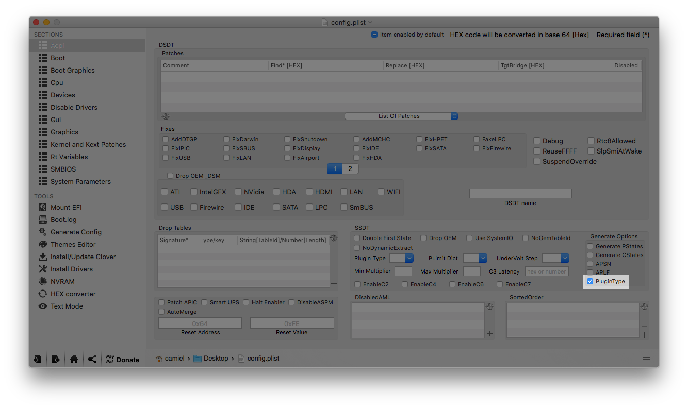

# Power Management

Native macOS power management delivers the best combination of processor and graphics performance and efficiency. 

Native power management does not require you to change specific BIOS settings. You will only need to instal one power management SSDT.

Power management is not a must, however, working power management will result in lower temps and less energy usage.

## For Haswell or newer
This only work on Clover v4307 or newer.

Open your config.plist in Clover Configurator and go to the ACPI section. In there, under SSDT (bottom left), check PluginType.



## For Ivy Bridge or older generation Intel CPUs or laptops:

Piker Alpha's [ssdtPRGen](https://github.com/Piker-Alpha/ssdtPRGen.sh) script will generate a SSDT you can use to achieve the maximum amount of power states for your desktop CPU.

### How to generate a SSDT with ssdtPRGen.sh

1. Setup your valid config.plist with the appropriate SMBIOS for your CPU using Clover Configurator.

2. Open Terminal and download Piker Alpha's ssdtPRGen.sh with the following command:

```
curl -o ~/ssdtPRGen.sh https://raw.githubusercontent.com/Piker-Alpha/ssdtPRGen.sh/Beta/ssdtPRGen.sh
```

3. The next step is to change the permissions of the executable so that it can be run.

```
chmod +x ~/ssdtPRGen.sh
```

4. For default SSDT generation, run this command:

```
sudo ~/ssdtPRGen.sh
```

5. If ssdtPRGen.sh ask you to open the generated SSDT in Finder, enter N.

6. Use Finder and find ~/Library/ssdtPRGen/SSDT.aml

7. Mount your EFI partition (howto [here](/..master/Tips.md#how-to-mount-efi)) and copy the generated SSDT.aml to /EFI/Clover/ACPI/patched.

NOTE: The Power Management SSDT should always be SSDT.aml. If you have an SSDT.aml there already, rename it SSDT-1.aml, etc...

8. Reboot

### How to generate a SSDT with ssdtPRGen.sh for K-series CPU

1. Doing 1,2, 3 step

2. To generate SSDT follow your overclock speed, i7-7700k = CPU, 4800 = 4,8GHz. Change it as your system

   `sudo sh ssdtPRGen.sh -p 'i7-7700k' -turbo 4800`

3. Doing 5, 6, 7 step

***Notes:***

- For some reasons, ssdtPRGen.sh script can't generate your CPU SpeedStep. Try to create your own User Defined.cfg, for more [here](https://github.com/Piker-Alpha/ssdtPRGen.sh)

