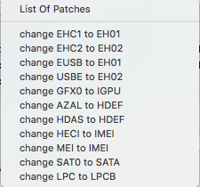

# Tips
## How to mount EFI
### macOS:

Open Terminal and run `diskutil list`, this will show you all your available Volumes. Look up your disk's name and remember the disk identifier that corresponds with your disk (this should look something like diskX). Once you're sure you have the right disk identifier that corresponds with your disk, run `diskutil mount diskXs1`, with the X being your disk number.

If you have only one EFI partition, you can also run `diskutil mount EFI`.

You can also mount your EFI partition with Clover Configurator, which it's easy and faster way.

### Windows:

1. Open Command Prompt as administrator (or PowerShell if you're "modern")
2. Type `mountvol X: /s`. This will mount the EFI partition to `X:`, you can change the letter to anything else as long as it's not used
3. Download [Explorer++](https://explorerplusplus.com/download)
4. Run it as administrator
5. ...
6. Edit

Also, to edit your config.plist on Windows, you can use [Clover Configurator Cloud](http://cloudclovereditor.altervista.org/cce/index.php). Backup the old one before edit it

## How to install kexts
A small disclaimer first, please try to inject kexts whenever you can. There is a possibility that if you update, your kexts will be deleted because they're in a place they're not supposed to be in if you install them to either `/Library/Extensions` or `/System/Library/Extensions`. You should only install kexts to /EFI/Clover/kexts/Other/

If you have two version of the same kext like 1.2.0 and 1.3.0 on both EFI and /S/L/E then system will crashing/kernel panic, so only install your kext at one place

To inject a kext, [mount your EFI]((Tips.md#how-to-mount-efi)) and go to /EFI/Clover/kexts/Other and place your kext(s) in there. Also make sure that `InjectKexts` is set to `Yes` inside of your config.plist.

## How to know if you need to hot-patch DSDT
Download [IOREG](http://mac.softpedia.com/get/System-Utilities/IORegistryExplorer.shtml) and search for what a patch tells you to replace in it's comment.

So let's say you want to rename HDAS to HDEF, please search if you even have HDEF first and if you do, this patch is not needed. If you do not have HDEF, apply the patch and reboot. You should now see HDEF in your IOREG

Be **very** careful while entering the patching info.

Some example of hotpatch:



- GFX0 to IGPU: Fix HDMI Audio from iGPU. Fix iGPU graphics crashing, allow hardware encoding on iGPU
- AZAL/HDAS to HDEF: This will rename to match your Audio Codec same like real Mac
- ....

## IntelGraphicsDVMTFixup

Quoted from [the IntelGraphicsDVMTFixup Github repo](https://github.com/BarbaraPalvin/IntelGraphicsDVMTFixup):
`
A common problem with Broadwell/Skylake/KabyLake is relatively small DVMT-prealloc setting by PC OEMs. The Apple framebuffer kexts generally assume 64mb or larger, and most PC OEMs use only 32mb. And often, there is no way to change it easily due to limited BIOS, locked down BIOS, etc.
`

This kext features the following:
* Fixes an issue related to a DVMT panic when entering the installation screen.
* Fixes the need for "FakeID = 0x12345678" in the config.plist.

You can download the kext from [here](https://docs.google.com/spreadsheets/d/1WQ87XQKgJVPPub_CbjoHsUscgyxrGg3DWzZz7Nnf_RU/edit#gid=0). How to install [here](Tips.md#how-to-install-kexts)

## USBInjectAll
This kext injects all available USB ports to the OS. This is absolutely necessary when installing, you will get the `Still waiting for root device...` hang otherwise.

Only Intel controllers are currently supported and the most commonly used SMBIOS model identifiers are in the kext.

[link to repo](https://github.com/RehabMan/OS-X-USB-Inject-All)

Patches needed:
- Port limit patch (raw XML)
```plist
<dict>
    <key>Comment</key>
    <string>change 15 port limit to 26 in XHCI kext</string>
    <key>MatchOS</key>
    <string>10.13.x</string>
    <key>Name</key>
    <string>com.apple.driver.usb.AppleUSBXHCIPCI</string>
    <key>Find</key>
    <data>g32MEA==</data>
    <key>Replace</key>
    <data>g32MGw==</data>
</dict>
```

- Clover configurator friendly:
```
Comment: change 15 port limit to 26 in XHCI kext
Name:    com.apple.driver.usb.AppleUSBXHCIPCI
Find:    837d8c10
Replace: 837d8c1b
```

DSDT Patches (All of these are Clover Configurator friendly, raw patches [here](https://github.com/RehabMan/OS-X-USB-Inject-All/blob/master/config_patches.plist#L8-L53)):
(DISCLAIMER: These patches should only be used when they are needed. More info [here](Tips.md#how-to-know-if-you-need-to-hot-patch-dsdt))

```
Comment: change _OSI to XOSI
Find:    5f4f5349
Replace: 584f5349
```

```
Comment: change EHC1 to EH01
Find:    45484331
Replace: 45483031
```

```
Comment: change EHC2 to EH02
Find:    45484332
Replace: 45483032
```

```
Comment: change XHCI to XHC
Find:    58484349
Replace: 5848435f
```

```
Comment: change XHC1 to XHC
Find:    58484331
Replace: 5848435f
```
