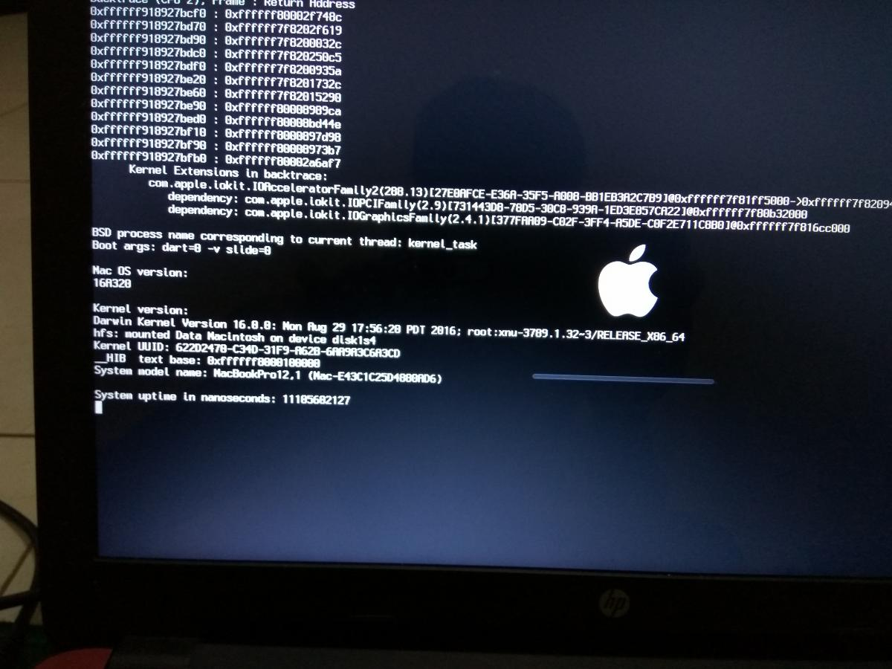
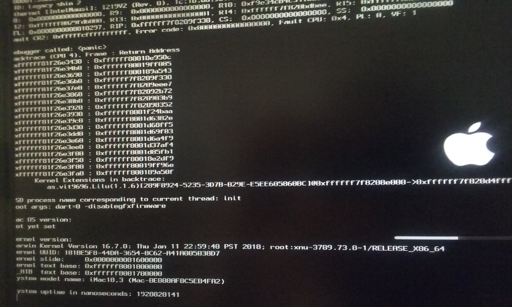

# Troubleshooting

## Black screen
You should use other display cable/other output port on your GPU

### For NVIDIA GPU

Because of the way how vanilla real Mac work, a small piece of a kernel extension that comes with macOS needs to be modified to prevent a black screen on some SMBIOSes after booting. Here is the list of affected SMBIOSes:

- iMac15,1 and up (iMac17,1)
- MacPro6,1

You do not have to manually modify anything inside of the kext that causes this issue since [lvs1974](https://github.com/lvs1974) made a kext, called [NvidiaGraphicsFixup](https://github.com/lvs1974/NvidiaGraphicsFixup), to patch this issue. You will need to install Lilu and NvidiaGraphicsFixup to apply this patch. You can download NvidiaGraphicsFixup and Lilu [here](https://1drv.ms/f/s!AiP7m5LaOED-mo9XA4Ml-69cwAsikQ).

NvidiaGraphicsFixup can do a lot of things:

- Adds the AGDP fix to iMac15,1;, iMac17,1;, iMac18,x and MacPro6,1 SMBIOSes to prevent a black screen after boot.
- Modifies macOS to recognize NVIDIA's web drivers as platform binaries. This resolves the issue with transparent windows without content, which appear for applications that use Metal and have Library Validation enabled. Common affected applications are iBooks and Little Snitch Network Monitor, though this patch is universal and fixes them all.
- Injects IOVARendererID into GPU properties (required for Shiki-based solution for non-freezing Intel and/or any discrete GPU)
- Allows to use ports HDMI, DP, Digital DVI with audio (Injects @0connector-type - @5connector-type properties into GPU)

So even if you not using any affected SMBIOS, you should install NvidiaGraphicsFixup.kext too

## NVIDIA Web drivers not apply after reboot
If you have NvidiaWeb checked in your config and webdrivers are still not working, try the following:

- Open Terminal and do the following one line at a time:
  - `sudo -s`
  - `nvram -c`
  - `nvram myvar=test`
  - `exit`
- Reboot
- Open Terminal and do `nvram -p | grep -i myvar`

If you don't get any output fromt the last command, install EmuVariableUefi-64.efi and the RC Scripts via the [latest clover install package](https://github.com/Dids/clover-builder/releases/latest/).

For some case, you need to remove -v boot flag if you using High Sierra in order to apply NVIDIA Web Driver.

## Massive ACPI kernel panic on Gigabyte boards
You can fix this by dropping the MATS table in your config.plist. Open your config.plist with Clover Configurator and Go to ACPI > Drop Tables (bottom left). Click the + button and set Signature to `MATS`.

## Kernel Panic

### Dynamic Video Memory Technology (DVMT)

macOS require 64MB DVMT-Memory for booting with iGPU, you can change it in BIOS/UEFI settings. 

### Kext outdated

As you can see, this is a problem causing by Lilu.

Just disabled this kext by press Space when Clover preparing to boot, then update your kext and reboot.

